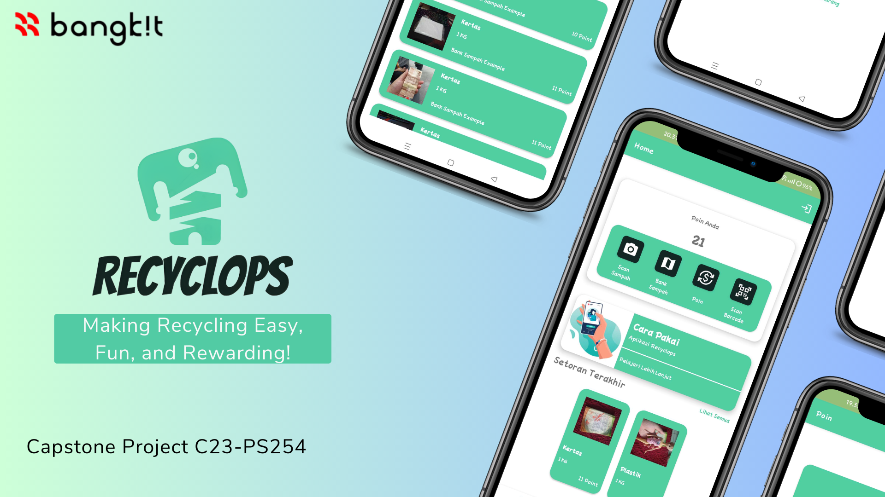
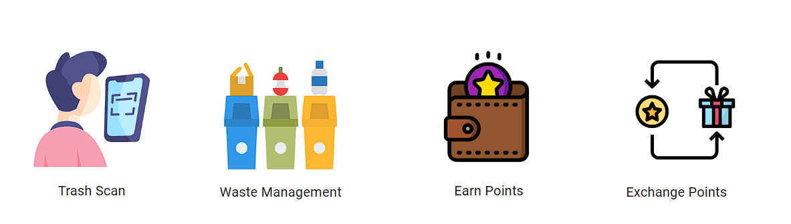

# Recyclops

Bangkit Capstone Project 2023

Team ID: C23-PS254

Selected Themes/Case: Sustainable Living

Member Name:
| Learning Path | Name | ID | Asal Universitas |
| ------ | ------ | ------ | ------ |
| Machine Learning | Fathur Rahman Al Farizy | M151DSX1309 | Universitas Brawijaya
| Machine Learning | Indra Septiawan | M367DSX0217 | Universitas Tulungagung
| Cloud Computing | Muhammad Safari Firdaus | C086DSX0958 | Sekolah Tinggi Teknologi Bandung
| Cloud Computing | Zidane Putra Andriant | C086DSX0658 | Sekolah Tinggi Teknologi Bandung
| Mobile Development | Daffa Aditya Rahman | A150DSX1077 | Universitas Bina Sarana Informatika
| Mobile Development | Abdurrahman Shahab | A086DSX1261 | Sekolah Tinggi Teknologi Bandung

## Backgrounder
Waste management is an important issue facing many communities, and proper waste sorting is crucial for reducing contamination and promoting recycling. However, traditional waste sorting methods can be confusing and inconvenient for users, leading to contamination and reduced recycling rates. An application-based waste sorting system could provide a more efficient and convenient solution to this problem.

Waste management is a complex and challenging issue, with environmental, social, and economic implications. Proper waste sorting is essential for reducing contamination and promoting recycling, but traditional waste sorting methods can be confusing and inconvenient for users. An application-based waste sorting system could provide a more efficient and convenient solution to this problem, leveraging the ubiquity of smartphones and the power of technology to simplify waste sorting and promote sustainability. 

## About Our App
Recyclops (the name is taken from recycle and cyclops, cyclops is the camera’s phone that capture the trash) is a groundbreaking mobile application designed to revolutionize waste management and recycling practices. With its user-friendly interface and innovative features, Recyclops aims to empower individuals and communities to actively participate in sustainable waste management. The app provides a comprehensive solution for waste classification, tracking, and exchange, creating a dynamic platform for waste banks and eco-conscious individuals to connect and contribute to a greener future.

## Feature

## Dataset Link

[Dataset]

## Library for Backend System
- [google cloud storage]
- [axios]
- [firebase-admin]
- [express]
- [multer]
- [body-parser]
- [routes]
- [dotenv]
- [requests]
- [numpy]
- [flask]
- [tensorflow]
- [tensorflow hub]
- [pillow]

## Library for Android Application
- [RecyclerView] 
- [Lifecycle] 
- [Glide] 
- [Retrofit 2]  
- [Material Design]
- [Datastore]
- [Firebase Ui Auth]
- [CameraX] 
- [Google Play Services] 
- [Firebase Auth]

## Deployed Link

Deployed APK:
[Recyclops.Apk] 

Demo Video:
[Demo Video].

## 10 Min Presentation Link

For video presentation link, check this [Youtube].

## Deploy Server to GCP

Documentation on deploying to Google Cloud Platform, check this [gcp-deploy].

## Future Update

TBD

[//]: # (These are reference links used in the body of this note and get stripped out when the markdown processor does its job. There is no need to format nicely because it shouldn't be seen. Thanks SO - http://stackoverflow.com/questions/4823468/store-comments-in-markdown-syntax)

   [Recyclops.Apk]: <https://drive.google.com/file/d/1oiVZEyde-X9bimXCD_4AnTcQBMvcFOTN/view?usp=sharing>
   [Demo Video]: <https://drive.google.com/file/d/1lUxnFKxhfeuqe0JGoEiejdkDWzt24pa-/view?usp=sharing>
   [Dataset]: <https://www.kaggle.com/datasets/40801637f6f0746c8ee76e66812da0bc51363e1b707737f05085777528a6859a>
   [Youtube]: <https://youtu.be/VPozlOGYTYc>
   [deploy-gcp]: <https://github.com/1be0nly/recyclops/blob/main/doc/deploy-gcp.md>
   [google cloud storage]: <https://www.npmjs.com/package/@google-cloud/storage>
   [axios]: <https://www.npmjs.com/package/axios>
   [firebase-admin]: <https://www.npmjs.com/package/firebase-admin>
   [express]: <https://expressjs.com/>
   [multer]: <https://www.npmjs.com/package/multer>
   [body-parser]: <https://www.npmjs.com/package/body-parser>
   [routes]: <https://expressjs.com/en/guide/routing.html>
   [dotenv]: <https://www.npmjs.com/package/dotenv>
   [requests]: <https://requests.readthedocs.io/en/latest/>
   [numpy]: <https://numpy.org/>
   [flask]: <https://flask.palletsprojects.com/en/2.3.x/>
   [tensorflow]: <https://www.tensorflow.org/>
   [tensorflow hub]: <https://www.tensorflow.org/hub/>
   [pillow]: <https://pillow.readthedocs.io/en/stable/>
   [RecyclerView]: <https://developer.android.com/jetpack/androidx/releases/recyclerview>
   [Lifecycle]: <https://developer.android.com/jetpack/androidx/releases/lifecycle>
   [Glide]: <https://github.com/bumptech/glide>
   [Retrofit 2]:  <https://square.github.io/retrofit/>
   [Material Design]: <https://github.com/material-components/material-components-android>
   [Datastore]: <https://developer.android.com/topic/libraries/architecture/datastore?gclid=CjwKCAiA55mPBhBOEiwANmzoQtX8aFaxx5WFTDOpYVN429tF3U8X3BnZu8ZMfJhRqGtyme_PzaypHhoCQDsQAvD_BwE&gclsrc=aw.ds#datastore-preferences>
   [Firebase Ui Auth]: <https://github.com/firebase/FirebaseUI-Android>
   [CameraX]: <https://developer.android.com/training/camerax?hl=id>
   [Google Play Services]:  <https://developer.android.com/distribute/play-services>
   [Firebase Auth]: <https://firebase.google.com/docs/auth/android/start>
  
